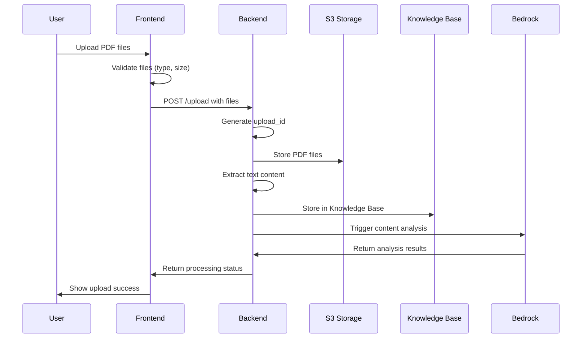
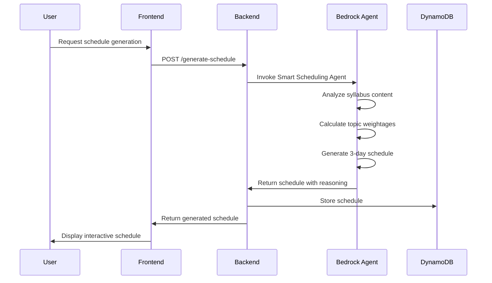
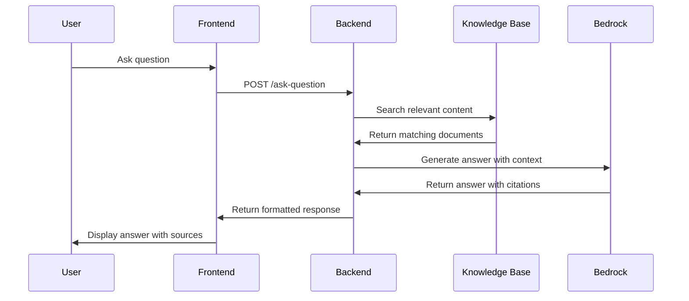

# Design Document - Exam-Sarthi

## System Architecture Overview

Exam-Sarthi follows a modern cloud-native architecture leveraging AWS services for AI capabilities, with a React frontend and FastAPI backend. The system is designed for scalability, reliability, and optimal user experience.

### High-Level Architecture

```
┌─────────────────┐    ┌─────────────────┐    ┌─────────────────┐
│   React.js      │    │   FastAPI       │    │   AWS Bedrock   │
│   Frontend      │◄──►│   Backend       │◄──►│   Services      │
│                 │    │                 │    │                 │
└─────────────────┘    └─────────────────┘    └─────────────────┘
         │                       │                       │
         │                       │                       │
         ▼                       ▼                       ▼
┌─────────────────┐    ┌─────────────────┐    ┌─────────────────┐
│   User Session  │    │   DynamoDB      │    │   S3 Storage    │
│   Management    │    │   Database      │    │   (PDFs)        │
└─────────────────┘    └─────────────────┘    └─────────────────┘
```

## Component Design

### 1. Frontend Layer (React.js)

#### 1.1 Component Structure
```
src/
├── components/
│   ├── common/
│   │   ├── Header.jsx
│   │   ├── Footer.jsx
│   │   └── LoadingSpinner.jsx
│   ├── upload/
│   │   ├── FileUploader.jsx
│   │   ├── UploadProgress.jsx
│   │   └── FileValidator.jsx
│   ├── schedule/
│   │   ├── ScheduleViewer.jsx
│   │   ├── CalendarView.jsx
│   │   └── TopicWeightage.jsx
│   ├── qa/
│   │   ├── QuestionInput.jsx
│   │   ├── AnswerDisplay.jsx
│   │   └── ChatHistory.jsx
│   └── flashcards/
│       ├── FlashcardDeck.jsx
│       ├── FlashcardItem.jsx
│       └── ProgressTracker.jsx
├── pages/
│   ├── Dashboard.jsx
│   ├── Upload.jsx
│   ├── Schedule.jsx
│   ├── QA.jsx
│   └── Flashcards.jsx
├── hooks/
│   ├── useFileUpload.js
│   ├── useSchedule.js
│   └── useFlashcards.js
└── services/
    ├── api.js
    ├── fileService.js
    └── authService.js
```

#### 1.2 Key Frontend Features

**File Upload Component**
- Drag-and-drop interface with visual feedback
- Real-time upload progress with file validation
- Support for multiple file selection (max 5 files)
- File type and size validation (PDF, max 10MB)

**Schedule Viewer Component**
- Interactive calendar view with time slots
- Topic weightage visualization using charts
- Expandable topic details with reasoning
- Export functionality for offline access

**Q&A Interface**
- Chat-like interface with conversation history
- Real-time typing indicators during AI processing
- Source citation display with PDF references
- Follow-up question suggestions

**Flashcard System**
- Card-flipping animations with smooth transitions
- Progress tracking with completion percentages
- Difficulty-based organization and filtering
- Spaced repetition scheduling

### 2. Backend Layer (FastAPI)

#### 2.1 API Structure
```
app/
├── main.py
├── models/
│   ├── user.py
│   ├── schedule.py
│   ├── flashcard.py
│   └── upload.py
├── routers/
│   ├── upload.py
│   ├── schedule.py
│   ├── qa.py
│   └── flashcards.py
├── services/
│   ├── pdf_processor.py
│   ├── bedrock_service.py
│   ├── knowledge_base.py
│   └── schedule_generator.py
├── utils/
│   ├── validators.py
│   ├── encryption.py
│   └── error_handlers.py
└── config/
    ├── settings.py
    └── aws_config.py
```

#### 2.2 Core Services

**PDF Processor Service**
```python
class PDFProcessor:
    async def process_upload(self, file: UploadFile) -> ProcessingResult
    async def extract_text(self, pdf_path: str) -> str
    async def store_in_knowledge_base(self, content: str, metadata: dict)
    async def validate_pdf(self, file: UploadFile) -> ValidationResult
```

**Bedrock Service**
```python
class BedrockService:
    async def analyze_syllabus(self, content: str) -> AnalysisResult
    async def generate_schedule(self, analysis: dict) -> Schedule
    async def answer_question(self, question: str, context: str) -> Answer
    async def create_flashcards(self, topics: list) -> list[Flashcard]
```

**Schedule Generator Service**
```python
class ScheduleGenerator:
    async def create_crash_course(self, weightage: dict) -> Schedule
    async def optimize_time_allocation(self, topics: list) -> dict
    async def generate_reasoning(self, schedule: Schedule) -> str
```

### 3. AWS Integration Layer

#### 3.1 Bedrock Knowledge Base Setup
```python
# Knowledge Base Configuration
KNOWLEDGE_BASE_CONFIG = {
    "name": "exam-sarthi-kb",
    "description": "Student uploaded PDFs and study materials",
    "roleArn": "arn:aws:iam::account:role/BedrockKnowledgeBaseRole",
    "dataSource": {
        "type": "S3",
        "s3Configuration": {
            "bucketArn": "arn:aws:s3:::exam-sarthi-pdfs",
            "inclusionPrefixes": ["uploads/"]
        }
    },
    "vectorIndexConfiguration": {
        "dimensions": 1536,
        "engine": "opensearch"
    }
}
```

#### 3.2 Agent Configuration
```python
# Smart Scheduling Agent
SCHEDULING_AGENT_CONFIG = {
    "agentName": "smart-scheduling-agent",
    "foundationModel": "anthropic.claude-3-5-sonnet-20241022-v2:0",
    "instruction": """
    You are an expert study planner. Analyze uploaded syllabus and PYQ PDFs to:
    1. Identify topic weightages based on frequency and marks distribution
    2. Create optimized 3-day crash course schedules
    3. Provide reasoning for time allocations
    4. Consider topic dependencies and learning sequences
    """,
    "knowledgeBaseId": "KB_ID_FROM_SETUP"
}
```

### 4. Data Models

#### 4.1 Database Schema (DynamoDB)

**Users Table**
```python
{
    "PK": "USER#user_id",
    "SK": "PROFILE",
    "user_id": "uuid",
    "email": "string",
    "created_at": "timestamp",
    "last_login": "timestamp",
    "preferences": {
        "study_hours_per_day": "number",
        "difficulty_preference": "string"
    }
}
```

**Schedules Table**
```python
{
    "PK": "USER#user_id",
    "SK": "SCHEDULE#schedule_id",
    "schedule_id": "uuid",
    "title": "string",
    "created_at": "timestamp",
    "days": [
        {
            "day": 1,
            "topics": [
                {
                    "topic": "string",
                    "time_allocation": "number",
                    "weightage": "number",
                    "reasoning": "string"
                }
            ]
        }
    ],
    "total_topics": "number",
    "status": "active|completed"
}
```

**Flashcards Table**
```python
{
    "PK": "USER#user_id",
    "SK": "FLASHCARD#flashcard_id",
    "flashcard_id": "uuid",
    "topic": "string",
    "question": "string",
    "answer": "string",
    "difficulty": "easy|medium|hard",
    "created_at": "timestamp",
    "last_reviewed": "timestamp",
    "review_count": "number",
    "success_rate": "number"
}
```

**Uploads Table**
```python
{
    "PK": "USER#user_id",
    "SK": "UPLOAD#upload_id",
    "upload_id": "uuid",
    "filename": "string",
    "file_type": "syllabus|pyq",
    "s3_key": "string",
    "processing_status": "pending|processing|completed|failed",
    "uploaded_at": "timestamp",
    "processed_at": "timestamp",
    "metadata": {
        "file_size": "number",
        "page_count": "number",
        "extracted_topics": ["string"]
    }
}
```

## System Workflows

### 1. PDF Upload and Processing Workflow



### 2. Schedule Generation Workflow



### 3. Q&A Workflow



## Security Design

### 1. Authentication & Authorization
- JWT-based session management
- Secure token storage in httpOnly cookies
- Role-based access control for admin features
- Session timeout and refresh mechanisms

### 2. Data Protection
- End-to-end encryption for file uploads
- AES-256 encryption for data at rest
- TLS 1.3 for data in transit
- Secure key management using AWS KMS

### 3. Privacy Controls
- User data isolation in multi-tenant architecture
- Automatic data deletion upon user request
- Audit logging for compliance
- GDPR-compliant data handling

## Performance Optimization

### 1. Frontend Optimizations
- Code splitting and lazy loading
- Image optimization and compression
- Service worker for offline capabilities
- React.memo for component optimization

### 2. Backend Optimizations
- Connection pooling for database access
- Caching with Redis for frequent queries
- Async processing for file uploads
- Rate limiting to prevent abuse

### 3. AWS Service Optimizations
- Bedrock model selection based on task complexity
- Knowledge Base chunking strategy optimization
- S3 lifecycle policies for cost management
- CloudFront CDN for global content delivery

## Error Handling Strategy

### 1. Frontend Error Handling
```javascript
// Global error boundary
class ErrorBoundary extends React.Component {
    handleError(error, errorInfo) {
        // Log error to monitoring service
        // Show user-friendly error message
        // Provide recovery options
    }
}

// API error handling
const handleApiError = (error) => {
    switch (error.status) {
        case 400: return "Invalid request. Please check your input.";
        case 401: return "Session expired. Please log in again.";
        case 429: return "Too many requests. Please try again later.";
        case 500: return "Server error. Our team has been notified.";
        default: return "Something went wrong. Please try again.";
    }
};
```

### 2. Backend Error Handling
```python
# Custom exception classes
class ExamSarthiException(Exception):
    def __init__(self, message: str, error_code: str, status_code: int = 500):
        self.message = message
        self.error_code = error_code
        self.status_code = status_code

class PDFProcessingError(ExamSarthiException):
    pass

class BedrockServiceError(ExamSarthiException):
    pass

# Global exception handler
@app.exception_handler(ExamSarthiException)
async def exam_sarthi_exception_handler(request: Request, exc: ExamSarthiException):
    return JSONResponse(
        status_code=exc.status_code,
        content={
            "error": exc.error_code,
            "message": exc.message,
            "timestamp": datetime.utcnow().isoformat()
        }
    )
```

## Monitoring and Observability

### 1. Application Metrics
- Response time monitoring
- Error rate tracking
- User engagement analytics
- Resource utilization metrics

### 2. AWS Service Monitoring
- Bedrock API usage and costs
- Knowledge Base query performance
- S3 storage metrics
- DynamoDB read/write capacity

### 3. Logging Strategy
- Structured logging with correlation IDs
- Centralized log aggregation
- Security event logging
- Performance bottleneck identification

## Deployment Architecture

### 1. Infrastructure as Code
```yaml
# docker-compose.yml for local development
version: '3.8'
services:
  frontend:
    build: ./frontend
    ports:
      - "3000:3000"
    environment:
      - REACT_APP_API_URL=http://localhost:8000
  
  backend:
    build: ./backend
    ports:
      - "8000:8000"
    environment:
      - AWS_REGION=us-east-1
      - DYNAMODB_TABLE_PREFIX=exam-sarthi-dev
    depends_on:
      - localstack
  
  localstack:
    image: localstack/localstack
    ports:
      - "4566:4566"
    environment:
      - SERVICES=s3,dynamodb,bedrock
```

### 2. Production Deployment
- AWS ECS for containerized deployment
- Application Load Balancer for traffic distribution
- Auto Scaling Groups for high availability
- CloudFormation for infrastructure management

## Testing Strategy

### 1. Frontend Testing
- Unit tests with Jest and React Testing Library
- Integration tests for component interactions
- E2E tests with Cypress
- Visual regression testing

### 2. Backend Testing
- Unit tests with pytest
- API integration tests
- Mock AWS services for testing
- Load testing with Locust

### 3. AI/ML Testing
- Bedrock response validation
- Knowledge Base retrieval accuracy
- Schedule generation quality metrics
- Flashcard relevance scoring

This design provides a comprehensive foundation for building the Exam-Sarthi application with scalability, security, and user experience as primary considerations.